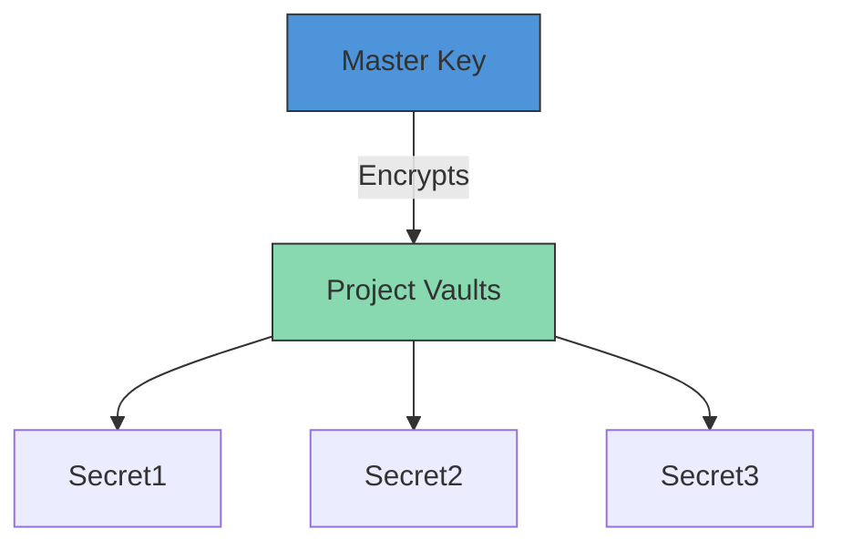

# 🛡️ O₂Security - Secure Secrets Management for Python


A simple and secure library for managing tokens, API keys, and other secrets in your Python projects. Stop hardcoding secrets and start managing them securely with a local, encrypted vault and a user-friendly web dashboard.

Dashboard review:


AI dashboard review:


## ✨ Key Features

| Feature | Description |
|---------|-------------|
| 🔒 **Military-Grade Encryption** | AES-256-GCM encryption for all secrets at rest |
| 🏠 **Local-First Storage** | Secrets stored in `~/.o2security` (never in git) |
| 🖥️ **Web Dashboard** | Beautiful interface for managing secrets |
| 🐍 **Python API** | Simple integration with any Python project |
| ⌨️ **CLI Access** | Manage secrets from terminal with `o2tokman` |
| 🔄 **Automatic Key Rotation** | Built-in security best practices |

## ⚡ Quick Install

```bash
pip install o2security
```

## 🚀 Quick Start

### 1. Launch the Dashboard
```bash
oxygen
```
Access at: `http://127.0.0.1:5001`

### 2. Create Project & Add Secrets
1. Create new project (e.g. `my-discord-bot`)
2. Add secrets (e.g. `DISCORD_TOKEN`)

### 3. Use in Your Code
```python
from o2security import tokman

# Load secrets
tokman.select_project("my-discord-bot")
bot_token = tokman.get("DISCORD_TOKEN")

# Use in your app
import discord
client = discord.Client()
client.run(bot_token)
```

## 🔐 Security Architecture



- **Master Key**: 256-bit key stored at `~/.o2security/master.key`
- **Project Vaults**: Individual encrypted JSON files
- **Zero Trust**: Secrets never leave your local machine

## 📚 Full Documentation

For advanced usage and API reference, visit:  
[project.donutmsv.ir](https://project.donutmsv.ir/projects/o2security)

## 💖 Support the Project

If you find O₂Security useful, please consider:

[](https://github.com/unknownmsv/o2security)

## 📜 License

Apache-2.0 license - See [LICENSE](LICENSE) for details.

---

*Built with ❤️ and 🐍 by [Unknownmsv](https://github.com/unknownmsv)*


